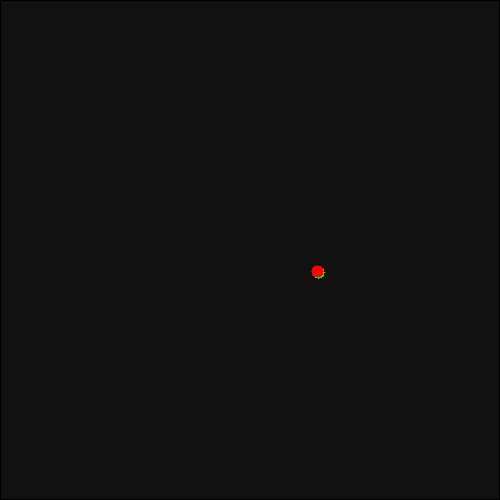

# **Rössler system with Runge-Kutta (4) Method**

Numerically Solving and Visualising [Rössler system](https://en.wikipedia.org/wiki/Rössler_attractor) by Runge - Kutta Method (4th order) on FORTRAN with **gnuplot** and generate GIF & MP4 animation


***

## GIF Animation generated:
<br>



# Usage:
* ## Visualization
  * Compile the fortran program with 
  ```gfortran Rossler_attractor.f90```
  * Run the compiled program with `./a.out` or `./a.exe`
  * Now, the data file for plotting should be in the folder, run `gnuplot plot_rossler_attractor_dat.gnu` to plot in Gnuplot
  * Use mouse to rotate and view from different angles


* ## Generating Animated GIF:

  * Uncomment lines 7 and 8 in [plot_Rossler_attractor_dat.gnu](plot_Rossler_attractor_dat.gnu)
  * Run run `gnuplot plot_Rossler_attractor_dat.gnu`
  * The [GIF](Rossler_attractor.gif) will be generated in the same folder


* ## Generating Animated MP4:
  * Run ```generate_animated_video.sh``` (requires ffmpeg)
  * The [Video]( rossler_attractor.mp4) will be generated in the same folder